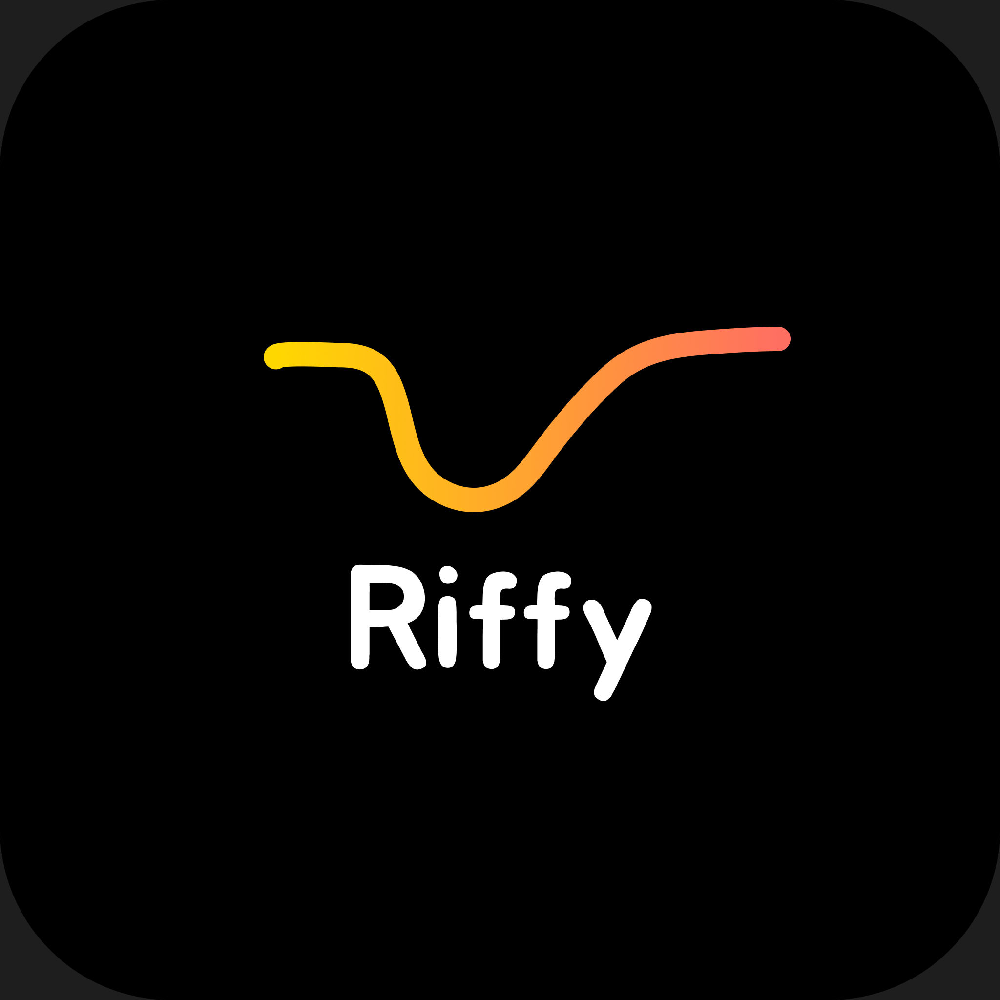

# :headphones: **Riffy**

  

---

## О проекте

### **Riffy** — это минималистичный музыкальный хостинг, где каждый пользователь может загружать и делиться своей музыкой. Основным ориентиром и примером для проекта является хостинг [*SoundCloud*](https://soundcloud.com/) 
## Функционал
### Riffy это общий сервис для слушателей и музыкантов. Слушатели могут создавать плейлисты со своей любимой музыкой, оценивать музыку, подписываться на исполнителей и многое другое. Музыканты могут публиковать свое творчество в виде альбомов, синглов или демо песен.

## :wrench: Стек технологий

- **Backend:** Go + [Gin](https://gin-gonic.com)
- **Frontend:** HTML, CSS, Vue.js
- **Data Base:** PostgreSQL
- **Кэширование:** Redis

## :star: Особенности Riffy

### Монетизация для исполнителей:
Изначально композиции полностью бесплатные для прослушивания, но авторы могут назначить цену для покупки альбома или одного сингла, тем самым монетизируя свое творчество
### AI Функции:
В будущем будут добавлены AI функции, такие как: 
 - "Рекомендации от ИИ"
 - "Музыка от ИИ"
 - Автоматические подборки на основе предпочтений пользователя
### Без подписок и рекламы:
В Riffy не будет рекламы и различных подписок для пользователей